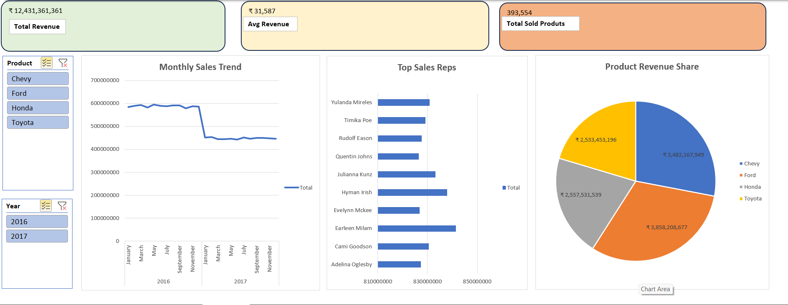

# Sales Analytics Dashboard (Excel Project)

## Project Overview
This project analyzes sales data to identify trends, top-performing products, and key revenue drivers. The goal was to transform raw data into an interactive dashboard for decision-making.

## Dashboard Preview

## Key Insights
- **Total Revenue:** Tracked over ₹12M+ in sales.
- **Top Product:** Identified the highest revenue-generating car models.
- **Seasonal Trends:** Visualized monthly performance to spot peak sales periods.

## Tools Used
- **Microsoft Excel** (Office 365)
- **Pivot Tables & Charts** (Data Summarization)
- **Power Query** (Data Cleaning)
- **Slicers** (Interactivity)

## How to Use
1. Download the `Sales_Performance_Report_2016-17.xlsx` file.
2. Open in Microsoft Excel.
3. Use the **Slicers** on the left to filter data by Year or Product.
